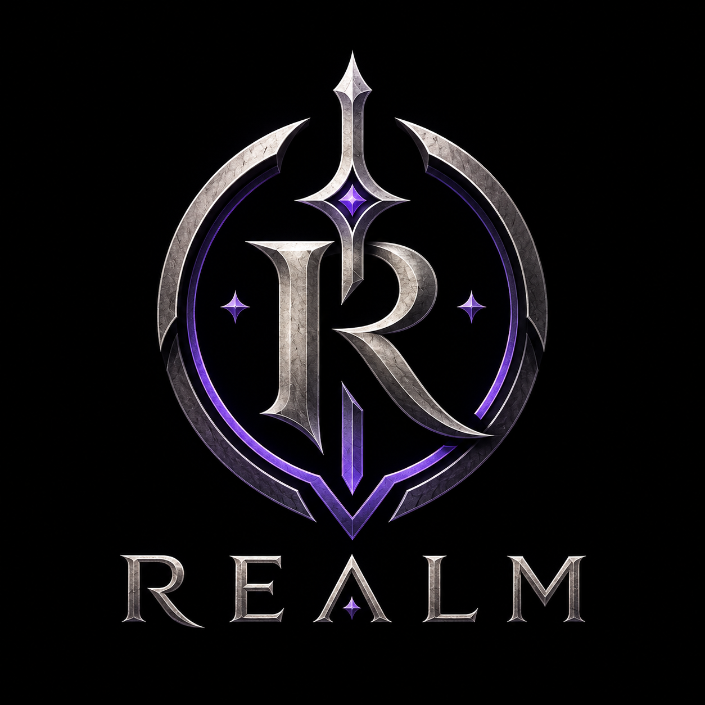

<div align="center">
  
  <h1>Realm — Discord Bot</h1>
</div>

A production-ready, fully modular Discord bot built with **discord.js v14**, **discord-player v6**, and **MongoDB (Mongoose)**.

---

## ✨ Features

| Category | Commands / Systems |
|----------|-------------------|
| 🛡️ Moderation | `/ban`, `/kick`, `/mute`, `/unmute`, `/warn`, `/purge` |
| 🎵 Music | `/play`, `/pause`, `/resume`, `/skip`, `/queue`, `/leave` |
| 📊 Leveling | `/rank`, `/leaderboard` |
| 🎫 Tickets | `/ticket panel` + button-driven open/close/delete + HTML transcripts |
| 🎭 Reaction Roles | `/reactionrole` — persistent across restarts |
| 🖼️ Custom Embeds | `/embed create/edit/show/delete/list` — interactive builder |
| ⚙️ Setup | `/setup` — per-guild config dashboard (welcome, staff roles, ticket category, mod logs, music channels) |
| 🔧 Utility | `/ping`, `/help` |

---

## 🚀 Quick Start

### 1. Prerequisites
- **Node.js** v18 or later
- A **MongoDB** instance (local or Atlas)
- A Discord application with a bot token — [Discord Developer Portal](https://discord.com/developers/applications)

### 2. Clone & Install

```bash
git clone https://github.com/YOUR_USERNAME/realm.git
cd realm
npm install
```

### 3. Configure Environment

```bash
cp .env.example .env
```

Open `.env` and fill in **all required values**:

```env
DISCORD_TOKEN=your-bot-token
DISCORD_CLIENT_ID=your-client-id
GUILD_ID=your-guild-id
MONGODB_URI=mongodb+srv://...
```

> ⚠️ **Never commit your `.env` file.** It is listed in `.gitignore`.

### 4. Deploy Slash Commands

Run this **once** every time you add or change a slash command:

```bash
node deploy-commands.js
```

### 5. Start the Bot

```bash
# Production
npm start

# Development (auto-restart on file changes)
npm run dev
```

---

## 📁 Project Structure

```
realm/
├── commands/
│   ├── leveling/        # rank, leaderboard
│   ├── moderation/      # ban, kick, mute, unmute, warn, purge
│   ├── music/           # play, pause, resume, skip, queue, leave
│   └── utility/         # ping, help, setup, embed, ticket, reactionrole
├── config/
│   └── config.js        # Centralised environment config with validation
├── database/
│   ├── connect.js       # MongoDB connection with retry + backoff
│   └── models/          # Mongoose schemas: GuildConfig, UserLevel, Ticket, Warn, CustomEmbed
├── events/              # Discord event handlers (ready, interactionCreate, messageCreate, ...)
├── middleware/
│   ├── permissions.js   # Permission & role checks
│   ├── rateLimiter.js   # Per-user command cooldowns
│   └── validateInput.js # Input sanitisation
├── systems/
│   ├── autoModeration.js   # Bad-word filter + anti-spam
│   ├── embedBuilderSystem.js # Interactive embed builder
│   ├── leveling.js          # XP gain & level-up
│   ├── logger.js            # Moderation action logging to Discord channel
│   ├── reactionRoles.js     # Reaction role assignment (DB-persisted)
│   ├── setupSystem.js       # Per-guild setup dashboard
│   └── ticketSystem.js      # Ticket lifecycle (create/close/delete + transcripts)
├── utils/
│   ├── appLogger.js     # Winston logger → console + logs/ files
│   ├── compileEmbed.js  # Renders CustomEmbed templates with placeholders
│   ├── createEmbed.js   # Standard embed factory
│   └── errorHandler.js  # Async error wrapper
├── logs/                # Runtime log files (git-ignored)
├── deploy-commands.js   # One-shot slash command registration
├── index.js             # Entry point
├── .env.example         # Template for environment variables
└── package.json
```

---

## ⚙️ Per-Server Configuration

Run `/setup` (requires **Administrator**) to configure:

- 👋 **Welcome System** — channel + custom embed template
- 🛠️ **Staff Roles** — roles that can manage tickets & run staff commands
- 🎫 **Ticket System** — category channel + transcript log channel
- 📝 **Moderation Logs** — channel for mod action embeds
- 🔇 **Muted Role** — fallback role for `/mute`/`/unmute`
- 🎵 **Music Voice Channels** — restrict `/play` to specific VCs

All configuration is stored per-guild in MongoDB — the bot can serve multiple servers independently.

---

## 🎵 Music Notes

- Uses **discord-player v6** + **YoutubeiExtractor** for YouTube playback
- Also supports **Spotify**, **SoundCloud**, **Apple Music** via `@discord-player/extractor`
- Requires **FFmpeg** (bundled via `ffmpeg-static`) and **libsodium** / **opusscript** for audio encoding

---

## 📝 Logs

At runtime the bot writes logs to `logs/` (created automatically, git-ignored):

| File | Contents |
|------|----------|
| `logs/combined.log` | All log levels (info, warn, error) |
| `logs/error.log` | Errors only — quick triage |

Files rotate at **5 MB** with up to 5 retained copies.

---

## 🤝 Contributing

1. Fork the repo
2. Create a branch: `git checkout -b feature/my-feature`
3. Commit your changes: `git commit -m "feat: add my feature"`
4. Push and open a PR

---

## 📄 License

MIT license